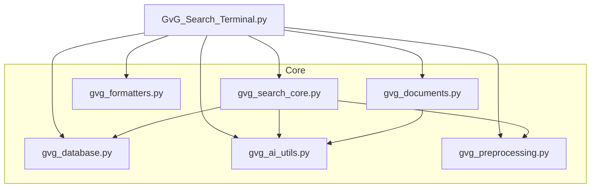
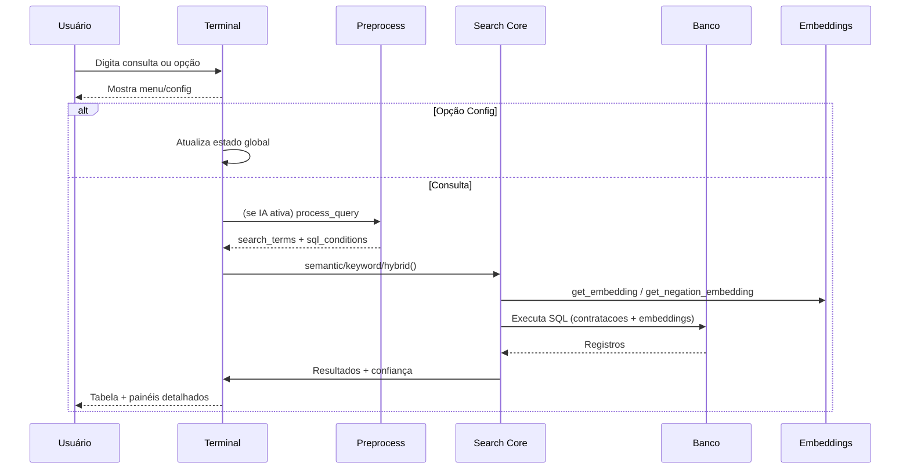
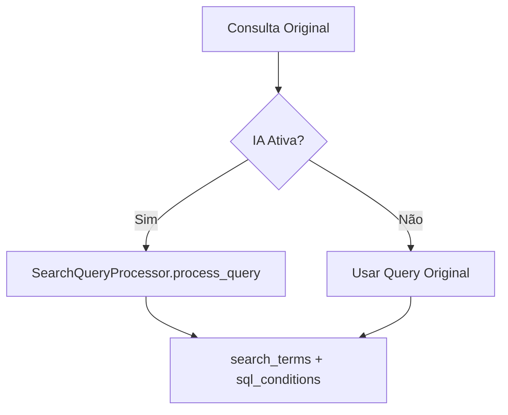
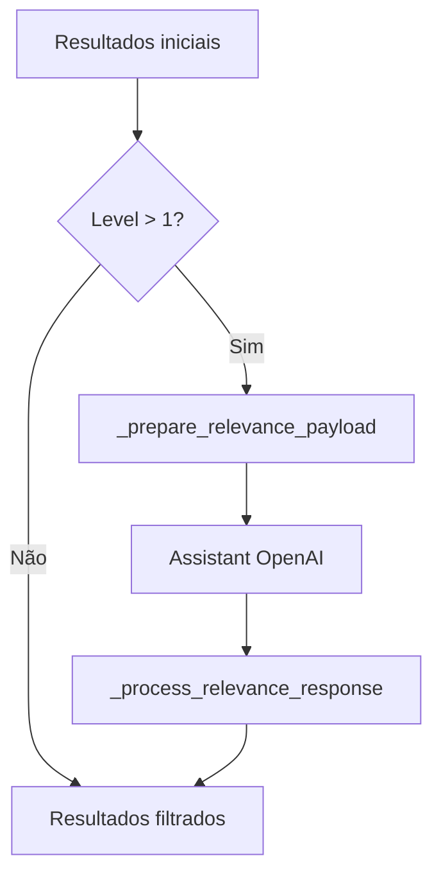
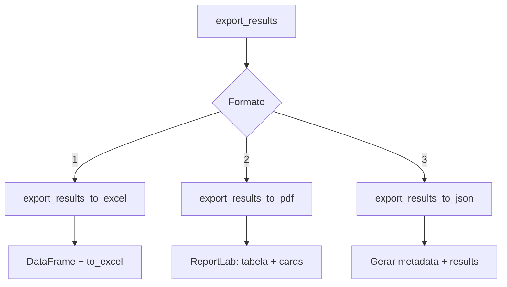

# 🚀 Diagrama Funcional Completo - GvG_Terminal_v2_Otimizado (Prompt_v2)

## 🎯 Visão Geral

A versão Prompt_v2 do terminal GvG implementa uma arquitetura enxuta: apenas funções realmente usadas foram mantidas e distribuídas em módulos especializados (formatters, AI/embeddings, busca core, banco, documentos, pré-processamento). Mantém as 3 modalidades de busca (semântica, palavras‑chave, híbrida), 3 abordagens (direta, correspondência simplificada, filtro simplificado), processamento inteligente opcional, exportações (Excel, PDF, JSON), processamento Docling v3 de documentos e geração de palavras‑chave.

---

## 🏗️ Arquitetura Modular



---

## 🔄 Fluxo Principal (Loop)



---

## 🔍 Tipos e Abordagens de Busca

```mermaid
graph TD
    A[perform_search] --> B{Abordagem}
    B -->|Direta| D1[direct_search]
    B -->|Correspondência| D2[correspondence_search (simulada)]
    B -->|Filtro| D3[category_filtered_search (simulada)]

    D1 --> T1{Tipo}
    T1 -->|Semântica| S1[semantic_search]
    T1 -->|Keyword| S2[keyword_search]
    T1 -->|Híbrida| S3[hybrid_search]

    S1 --> E1[get_embedding / negation]
    S2 --> E2[Full-text ts_rank / fallback ILIKE]
    S3 --> E3[Embeddings + ts_rank combinados]
```

---

## 🤖 Processamento Inteligente de Query



Resultado incorporado em cada resultado: details.intelligent_processing

---

## 🧪 Filtro de Relevância Interno (Search Core)

Níveis (1=desligado / 2=flexível / 3=restritivo). Implementado em `gvg_search_core` com chamadas opcionais a Assistants OpenAI (thread reutilizável). Aplicado pós-ranking se ativo.



---

## 📄 Sistema de Documentos (Docling v3)

```mermaid
graph TD
    SEL[Selecionar Processo] --> FD[fetch_documentos]
    FD --> LIST{Doc(s) Encontrados?}
    LIST -->|Não| ND[Nenhum]
    LIST -->|Sim| MENU[Menu Nº/A/V/Q]
    MENU -->|Nº| ONE[process_single_document]
    MENU -->|A| ALL[process_all_documents]
    MENU -->|V| LINKS[show_document_links]

    ONE --> PP[process_pncp_document]
    ALL --> PP
    PP --> DL[download_document]
    DL --> CV[convert_document_to_markdown]
    CV --> SUMM[generate_document_summary (OpenAI opcional)]
    SUMM --> SAVE1[save_markdown_file]
    SUMM --> SAVE2[save_summary_file]
```

ZIP: extração múltipla (todos arquivos suportados) com log detalhado.

---

## 🧠 Geração de Palavras‑chave

```mermaid
graph TD
    PICK[Selecionar Processo] --> DESC[Extrair descrição]
    DESC --> AIKW[generate_keywords (chat.completions)]
    AIKW --> KWLIST[Lista de palavras]
    KWLIST --> DISPLAY[Exibir formato v9]
```

---

## 💾 Exportações



Nome padrão: `Busca_{QUERY_SAN}_S{tipo}_A{abord}_R{relev}_O{ord}_{I/N}_{timestamp}.{ext}`

---

## 🧩 Principais Estruturas de Dados

Resultado de busca (por item):
- id / numero_controle
- similarity (float 0..1)
- rank
- details (dict campos contratação + intelligent_processing)

Intelligent Processing (`details.intelligent_processing`):
- original_query
- processed_terms
- applied_conditions
- explanation

Document Summary Output: string markdown formatado + arquivos persistidos (Markdown e SUMMARY).

---

## 🔌 Integrações Externas

| Área | Tecnologia | Uso |
|------|------------|-----|
| Embeddings | OpenAI text-embedding-3-large | semantic / hybrid / negation |
| Chat / Keywords | OpenAI gpt-3.5-turbo | generate_keywords |
| Summaries Doc | OpenAI gpt-4o | generate_document_summary |
| Banco | PostgreSQL + pgvector | consultas SQL vetoriais e full-text |
| Doc Conversion | Docling (PyPdfium + TableFormer FAST) | PDF/ZIP parsing |
| UI | Rich | Tabelas, painéis, progresso |
| PDF | ReportLab | Exportação relatório |
| Excel | pandas + openpyxl | Export planilha |

Fallbacks: keyword_search → ILIKE se full‑text indisponível; hybrid_search → fusão Python se SQL combinado falhar; documentos → API PNCP se DB vazio.

---

## 🌐 Estados Globais (Terminal)
- current_search_type / current_search_approach / current_sort_mode
- max_results / num_top_categories
- filter_expired / use_negation_embeddings
- intelligent_processing (proxy via get_intelligent_status)
- relevance_filter_level (local simplificado)
- last_results / last_query / last_query_categories

---

## ⚙️ Ciclo de Vida de uma Consulta
1. Usuário digita query
2. (Opcional) Pré-processamento → termos + condições SQL
3. Seleção de função conforme tipo (semantic/keyword/hybrid)
4. Execução SQL (embedding + ts_rank ou combinação)
5. Aplicação de filtro de relevância (se nível >1 e OpenAI disponível)
6. Ordenação adicional conforme sort mode
7. Exibição: tabela resumo + painéis detalhados
8. Ações opcionais: documentos / keywords / exportar

---

## ✅ Principais Diferenças vs v9
- Importações seletivas (sem wildcard * )
- Módulos separados (AI, DB, formatters, core, docs, preprocessing)
- Correspondência e Filtro simplificados (mock de categorias)
- Filtro de relevância implementado diretamente em `gvg_search_core`
- Documentos: sempre Docling v3 (sem alternância MarkItDown)
- Export JSON inclui metadados simplificados

---

## 🔐 Considerações de Segurança
- Chaves OpenAI lidas de variáveis ambiente / .env
- Sanitização de nome de arquivos de exportação e documentos
- Fallbacks evitam falhas críticas (rede / ausência de feature)

---

## 📈 Pontos de Otimização
- Redução de namespace: apenas funções usadas
- Menos overhead de importação dinâmica
- Filtros e processamento incremental (apenas quando necessário)
- Reuso de threads OpenAI (pré-processamento / relevância)

---

## 📝 Conclusão
A arquitetura Prompt_v2 entrega o mesmo conjunto funcional essencial do terminal anterior com menor acoplamento, clareza modular e pipelines de documentos e busca otimizados, preservando a experiência visual e fluxos operacionais herdados da versão v9.
