# 📊 Diagrama Funcional Completo - GvG_Terminal_v9

## 🎯 Visão Geral do Sistema

O **GvG_Terminal_v9** é um sistema avançado de busca para contratos públicos PNCP com três abordagens distintas de busca e processamento inteligente via IA.

---

## 🏗️ Arquitetura do Sistema

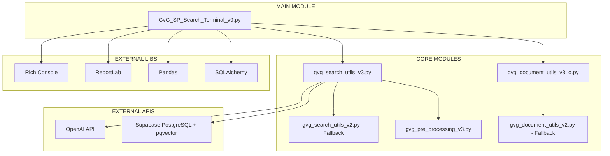

---

## 🔄 Fluxo Principal de Execução

### 1️⃣ **Inicialização do Sistema**

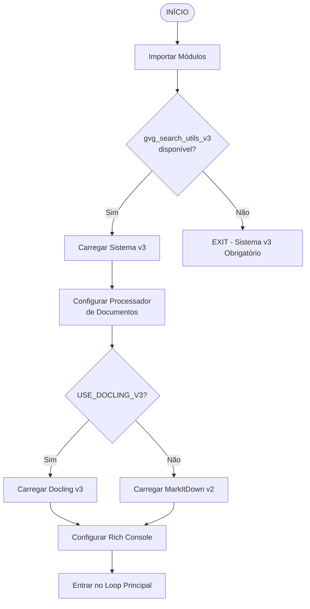

### 2️⃣ **Loop Principal do Menu**

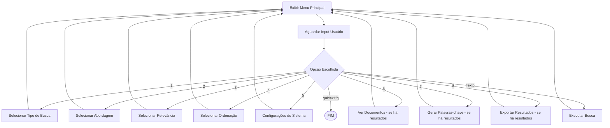

---

## 🔍 Sistema de Busca - Três Abordagens

### **Fluxo Geral de Busca**

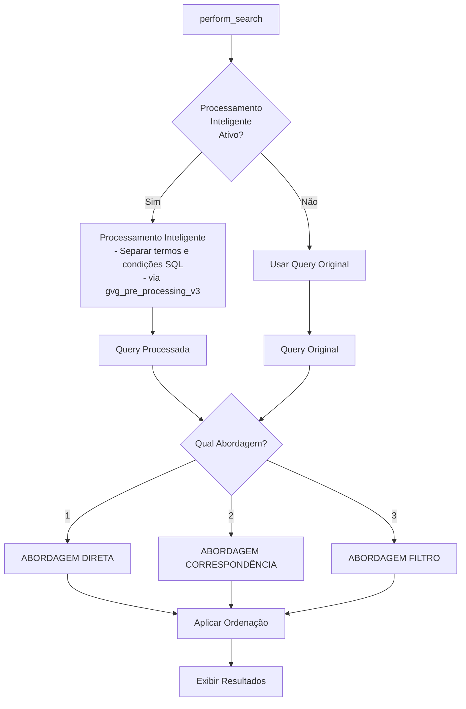

### **1️⃣ ABORDAGEM DIRETA**

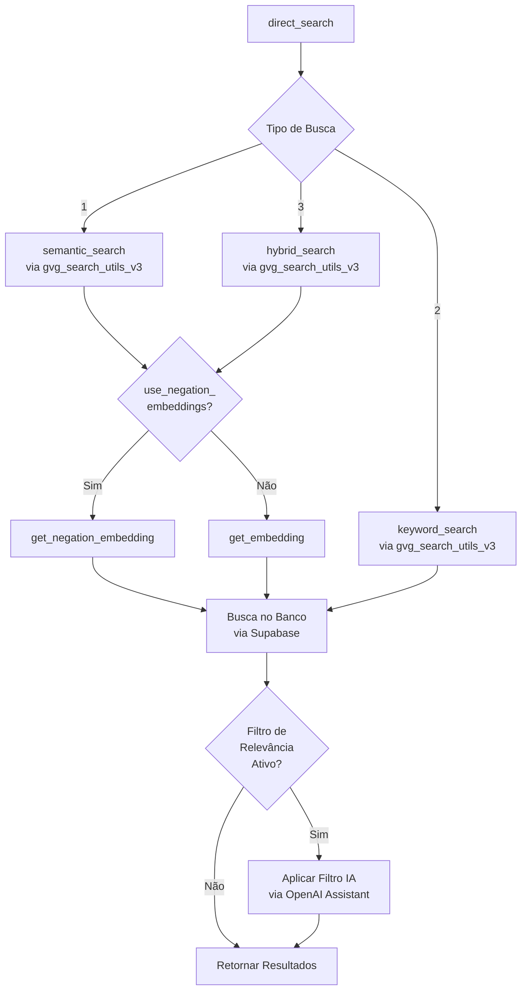

### **2️⃣ ABORDAGEM CORRESPONDÊNCIA**

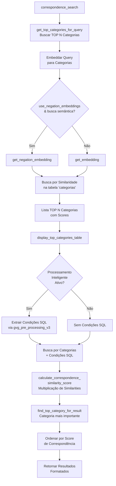

### **3️⃣ ABORDAGEM FILTRO**

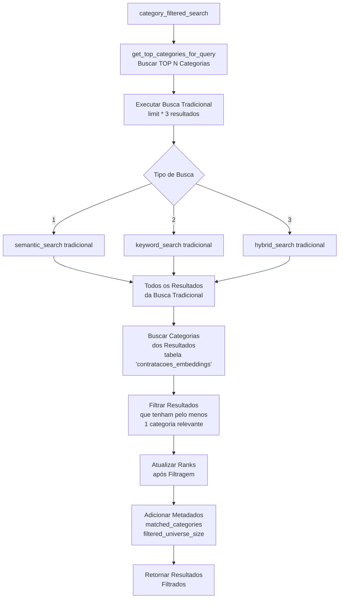

---

## 🤖 Sistema de Processamento Inteligente

### **Preprocessamento de Queries**

```mermaid
graph TD
    QUERY[Query do Usuário] --> INTEL_CHECK{Processamento<br/>Inteligente<br/>Ativo?}
    
    INTEL_CHECK -->|Sim| IMPORT_PREP[Importar<br/>gvg_pre_processing_v3]
    INTEL_CHECK -->|Não| SKIP_PREP[Usar Query Original]
    
    IMPORT_PREP --> CREATE_PROCESSOR[SearchQueryProcessor()]
    CREATE_PROCESSOR --> PROCESS_QUERY[process_query]
    
    PROCESS_QUERY --> OPENAI_CALL[Chamada para<br/>OpenAI Assistant]
    
    OPENAI_CALL --> SEPARATE[Separar:<br/>- search_terms<br/>- sql_conditions<br/>- explanation]
    
    SEPARATE --> PROCESSED[Query Processada]
    
    SKIP_PREP --> ORIGINAL[Query Original]
    
    PROCESSED --> RETURN_PROCESSED[Retornar Termos<br/>Processados]
    ORIGINAL --> RETURN_PROCESSED
```

### **Sistema de Filtro de Relevância**

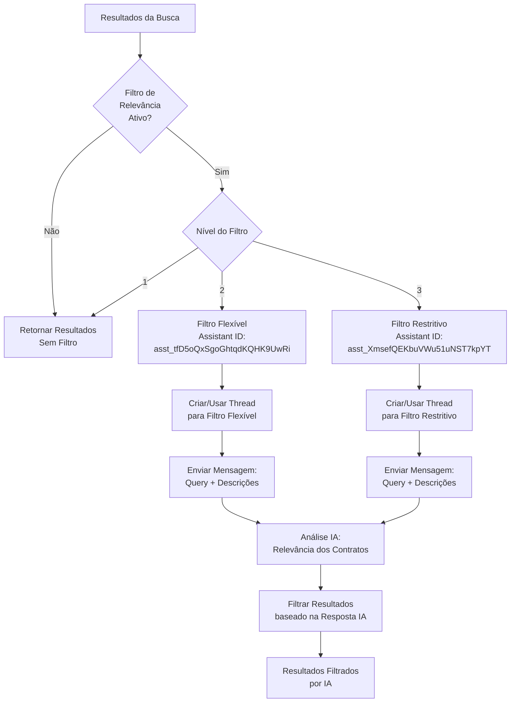

---

## 📄 Sistema de Documentos

### **Visualização e Processamento de Documentos**

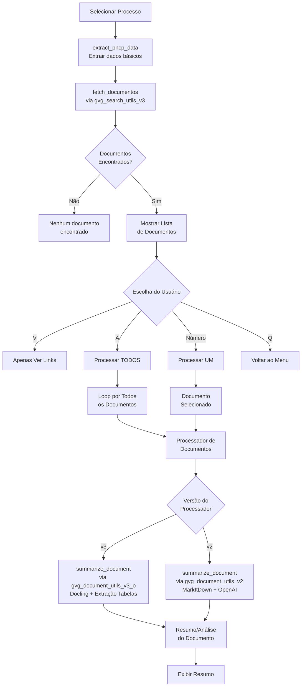

### **Geração de Palavras-chave**

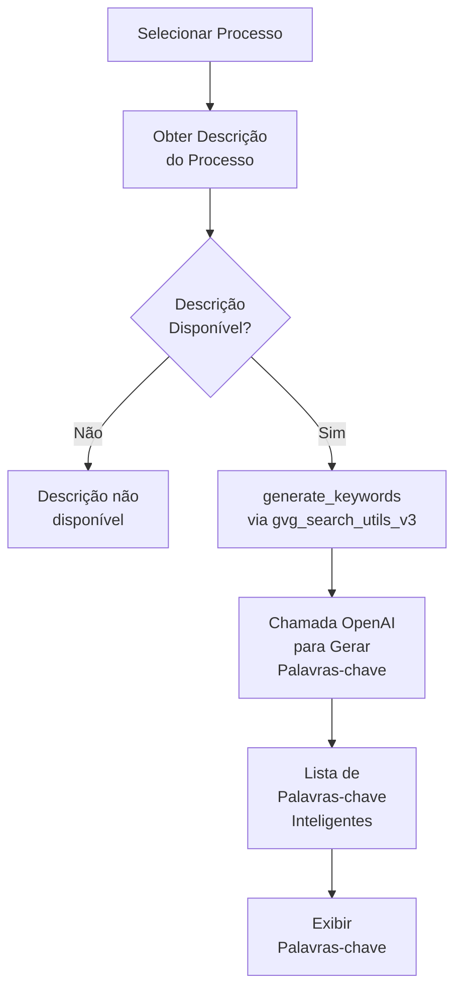

---

## 📊 Sistema de Exportação

### **Fluxo de Exportação**

```mermaid
graph TD
    EXPORT_START[export_results] --> HAS_RESULTS{Há Resultados<br/>para Exportar?}
    
    HAS_RESULTS -->|Não| NO_EXPORT[Nenhum resultado<br/>para exportar]
    HAS_RESULTS -->|Sim| CHOOSE_FORMAT[Escolher Formato<br/>1-Excel, 2-PDF, 3-JSON]
    
    CHOOSE_FORMAT -->|1| EXCEL[export_results_to_excel]
    CHOOSE_FORMAT -->|2| PDF[export_results_to_pdf]
    CHOOSE_FORMAT -->|3| JSON[export_results_to_json]
    
    EXCEL --> GEN_FILENAME_XL[generate_export_filename<br/>Busca_{QUERY}_S{type}_A{approach}_R{relevance}_O{sort}_I{intelligent}_{timestamp}.xlsx]
    PDF --> GEN_FILENAME_PDF[generate_export_filename<br/>Busca_{QUERY}_S{type}_A{approach}_R{relevance}_O{sort}_I{intelligent}_{timestamp}.pdf]
    JSON --> GEN_FILENAME_JSON[generate_export_filename<br/>Busca_{QUERY}_S{type}_A{approach}_R{relevance}_O{sort}_I{intelligent}_{timestamp}.json]
    
    GEN_FILENAME_XL --> PANDAS_DF[Criar DataFrame<br/>com Pandas]
    GEN_FILENAME_PDF --> REPORTLAB[Usar ReportLab<br/>para PDF]
    GEN_FILENAME_JSON --> JSON_FORMAT[Formatação JSON<br/>com Metadados]
    
    PANDAS_DF --> SAVE_EXCEL[Salvar .xlsx<br/>via openpyxl]
    REPORTLAB --> SAVE_PDF[Salvar .pdf<br/>com Tabelas e<br/>Detalhes Formatados]
    JSON_FORMAT --> SAVE_JSON[Salvar .json<br/>com encoding UTF-8]
    
    SAVE_EXCEL --> SUCCESS[Exportação<br/>Concluída]
    SAVE_PDF --> SUCCESS
    SAVE_JSON --> SUCCESS
```

---

## 🎛️ Sistema de Configuração

### **Configurações do Sistema**

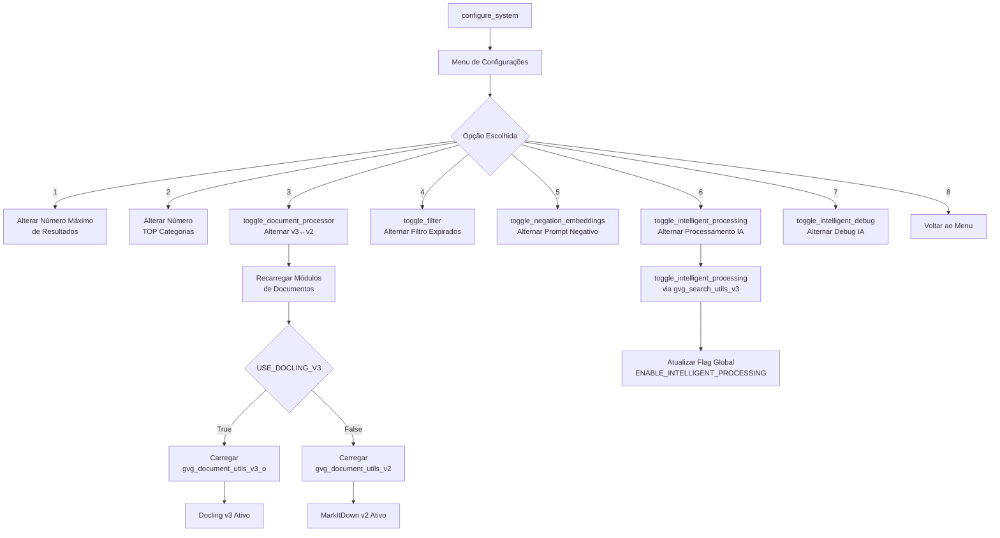

### **Seleção de Configurações de Busca**

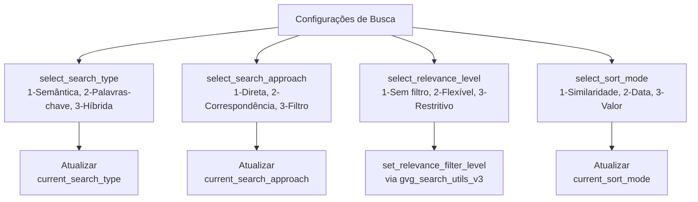

---

## 💾 Sistema de Banco de Dados

### **Conexões e Engines**

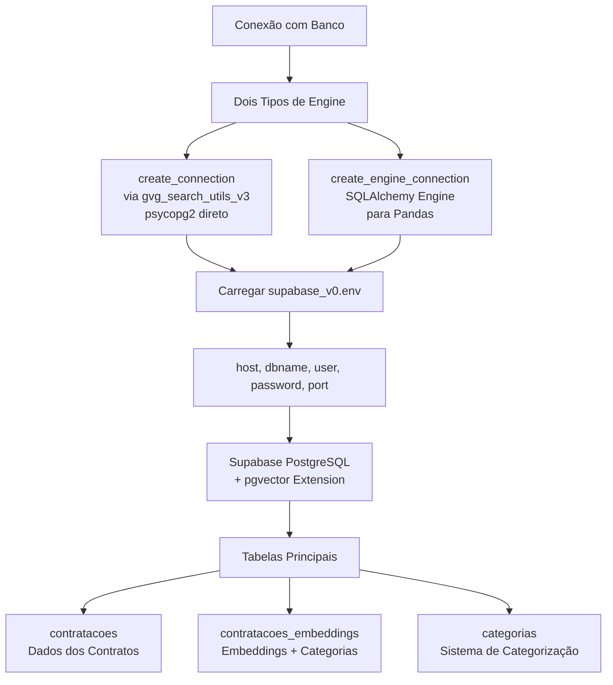

### **Operações de Busca no Banco**

```mermaid
graph TD
    SEARCH_DB[Busca no Banco] --> VECTOR_SEARCH[Busca Vetorial<br/>pgvector]
    
    VECTOR_SEARCH --> COSINE_SIM[Similaridade Coseno<br/><=> operator]
    
    COSINE_SIM --> EMBEDDING_TYPES[Tipos de Embedding]
    
    EMBEDDING_TYPES --> NORMAL[get_embedding<br/>OpenAI text-embedding-3-small]
    EMBEDDING_TYPES --> NEGATION[get_negation_embedding<br/>Processamento de<br/>Termos Positivos/Negativos]
    
    NORMAL --> SIMILARITY_CALC[1 - (embedding <=> query_embedding)<br/>AS similarity]
    NEGATION --> SIMILARITY_CALC
    
    SIMILARITY_CALC --> ORDER_RESULTS[ORDER BY similarity DESC]
    
    ORDER_RESULTS --> LIMIT_RESULTS[LIMIT por configuração]
```

---

## 🔧 Funções Auxiliares e Utilitárias

### **Formatação e Apresentação**

```mermaid
graph TD
    DISPLAY[display_results] --> RICH_CONSOLE[Rich Console<br/>Formatação Avançada]
    
    RICH_CONSOLE --> TABLE[Rich Table<br/>Resumo dos Resultados]
    RICH_CONSOLE --> PANELS[Rich Panels<br/>Detalhes por Resultado]
    
    TABLE --> FORMAT_CURRENCY[format_currency<br/>via gvg_search_utils_v3]
    TABLE --> FORMAT_DATE[format_date<br/>via gvg_search_utils_v3]
    
    PANELS --> HIGHLIGHT[highlight_key_terms<br/>Destacar termos da query]
    PANELS --> DECODE_PODER[decode_poder<br/>via gvg_search_utils_v3]
    PANELS --> DECODE_ESFERA[decode_esfera<br/>via gvg_search_utils_v3]
    
    HIGHLIGHT --> REGEX_REPLACE[Regex para destacar<br/>termos em [bold yellow]]
```

### **Cálculos de Similaridade**

```mermaid
graph TD
    SIMILARITY[Cálculos de Similaridade] --> CONFIDENCE[calculate_confidence<br/>via gvg_search_utils_v3<br/>Média das Similarities]
    
    SIMILARITY --> CORRESPONDENCE[calculate_correspondence_<br/>similarity_score<br/>Multiplicação:<br/>query_sim × result_sim]
    
    SIMILARITY --> TOP_CATEGORY[find_top_category_for_result<br/>Categoria com maior<br/>score de correspondência]
    
    CONFIDENCE --> MEAN_CALC[numpy.mean(similarities)]
    
    CORRESPONDENCE --> MAX_SCORE[Encontrar score máximo<br/>entre todas as categorias]
    
    TOP_CATEGORY --> BEST_MATCH[Retornar melhor match<br/>com metadados da categoria]
```

---

## 🌐 Integrações Externas

### **OpenAI API**

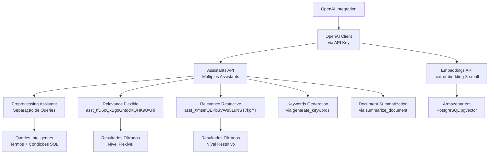

### **Supabase PostgreSQL**

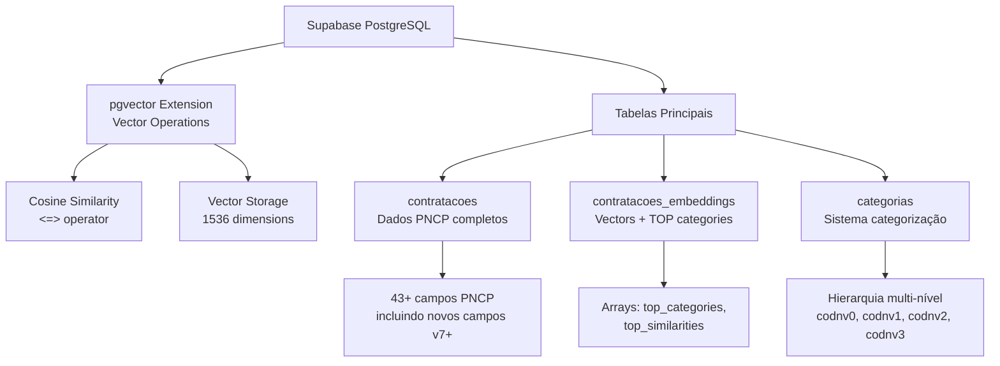

---

## 📈 Métricas e Monitoramento

### **Sistema de Debug e Logging**

```mermaid
graph TD
    DEBUG[Sistema de Debug] --> FLAGS[Debug Flags]
    
    FLAGS --> INTEL_DEBUG[DEBUG_INTELLIGENT_QUERIES<br/>Debug processamento IA]
    FLAGS --> RELEVANCE_DEBUG[DEBUG_RELEVANCE_FILTER<br/>Debug filtro relevância]
    FLAGS --> TEMP_DEBUG[Debug Temporário<br/>Status sistema v3]
    
    INTEL_DEBUG --> QUERY_INFO[Informações Query<br/>Original vs Processada]
    INTEL_DEBUG --> SQL_CONDITIONS[Condições SQL<br/>Extraídas]
    INTEL_DEBUG --> AI_EXPLANATION[Explicação IA<br/>do Processamento]
    
    RELEVANCE_DEBUG --> FILTER_STATUS[Status do Filtro<br/>Nível ativo]
    RELEVANCE_DEBUG --> AI_RESPONSES[Respostas IA<br/>Filtro relevância]
    
    TEMP_DEBUG --> SYSTEM_STATUS[Status Sistema<br/>v3 vs v2 fallback]
    TEMP_DEBUG --> MODULE_VERSIONS[Versões Módulos<br/>Carregados]
```

### **Medição de Performance**

```mermaid
graph TD
    PERFORMANCE[Medição Performance] --> SEARCH_TIME[Tempo de Busca<br/>start_time → end_time]
    
    SEARCH_TIME --> PHASES[Fases Medidas]
    
    PHASES --> PREPROCESSING_TIME[Tempo Preprocessamento<br/>IA]
    PHASES --> CATEGORY_TIME[Tempo Busca<br/>Categorias]
    PHASES --> SEARCH_EXEC_TIME[Tempo Execução<br/>Busca Principal]
    PHASES --> FILTER_TIME[Tempo Aplicação<br/>Filtros]
    PHASES --> SORT_TIME[Tempo Ordenação]
    
    SEARCH_TIME --> DISPLAY_TIME[Exibir Tempo Total<br/>na Interface]
```

---

## 🔄 Estados e Variáveis Globais

### **Estado Global do Sistema**

```mermaid
graph TD
    GLOBAL_STATE[Estado Global] --> SEARCH_CONFIG[Configurações Busca]
    GLOBAL_STATE --> SYSTEM_FLAGS[Flags Sistema]
    GLOBAL_STATE --> LAST_RESULTS[Últimos Resultados]
    
    SEARCH_CONFIG --> CURRENT_TYPE[current_search_type<br/>1-Semântica, 2-Palavras-chave, 3-Híbrida]
    SEARCH_CONFIG --> CURRENT_APPROACH[current_search_approach<br/>1-Direta, 2-Correspondência, 3-Filtro]
    SEARCH_CONFIG --> CURRENT_SORT[current_sort_mode<br/>1-Similaridade, 2-Data, 3-Valor]
    
    SYSTEM_FLAGS --> FILTER_EXPIRED[filter_expired<br/>Filtrar encerradas]
    SYSTEM_FLAGS --> USE_NEGATION[use_negation_embeddings<br/>Prompt negativo]
    SYSTEM_FLAGS --> USE_DOCLING[USE_DOCLING_V3<br/>Processador docs]
    SYSTEM_FLAGS --> NUM_CATEGORIES[num_top_categories<br/>TOP N categorias]
    
    LAST_RESULTS --> RESULTS_LIST[last_results<br/>Lista resultados]
    LAST_RESULTS --> LAST_QUERY[last_query<br/>Query anterior]
    LAST_RESULTS --> LAST_CATEGORIES[last_query_categories<br/>Categorias query anterior]
```

### **Configurações e Constantes**

```mermaid
graph TD
    CONSTANTS[Constantes Sistema] --> SEARCH_LIMITS[Limites Busca]
    CONSTANTS --> PATHS[Caminhos Arquivos]
    CONSTANTS --> DICTS[Dicionários Config]
    
    SEARCH_LIMITS --> MIN_RESULTS[MIN_RESULTS = 5]
    SEARCH_LIMITS --> MAX_RESULTS[MAX_RESULTS = 30]
    SEARCH_LIMITS --> MAX_TOKENS[MAX_TOKENS = 2000]
    SEARCH_LIMITS --> SEMANTIC_WEIGHT[SEMANTIC_WEIGHT = 0.75]
    
    PATHS --> BASE_PATH[BASE_PATH]
    PATHS --> RESULTS_PATH[RESULTS_PATH]
    PATHS --> FILES_PATH[FILES_PATH]
    
    DICTS --> SEARCH_TYPES[SEARCH_TYPES dict<br/>1,2,3 → nomes/descrições]
    DICTS --> SEARCH_APPROACHES[SEARCH_APPROACHES dict<br/>1,2,3 → nomes/descrições]
    DICTS --> SORT_MODES[SORT_MODES dict<br/>1,2,3 → nomes/descrições]
    DICTS --> RELEVANCE_LEVELS[RELEVANCE_LEVELS dict<br/>1,2,3 → nomes/descrições]
```

---

## 🎯 Pontos de Integração Críticos

### **1. Fallback System v3 → v2**
- O sistema **REQUER** gvg_search_utils_v3
- Se v3 não disponível → **EXIT** (não há fallback para v2)
- Para documentos: v3 ↔ v2 fallback automático

### **2. Processamento Inteligente**
- **Opcional**: Sistema funciona com/sem IA
- Se ativo: separação termos/condições SQL automática
- Se inativo: usa query original tradicional

### **3. Filtro de Relevância**
- **3 Níveis**: Sem filtro / Flexível / Restritivo
- Usa OpenAI Assistants específicos por nível
- Aplicado **APÓS** busca principal

### **4. Negation Embeddings**
- **Opcional**: Para prompts negativos
- Formato: "termo positivo -- termo negativo"  
- Apenas para busca Semântica e Híbrida

### **5. Sistema de Categorias**
- **Abordagens 2 e 3** dependem de categorização
- Busca TOP N categorias similares à query
- Multiplicação de similarities para correspondência

---

## 📋 Resumo das Principais Funcionalidades

### ✅ **Funcionalidades Principais**

1. **🔍 Três Tipos de Busca**
   - Semântica (embedding-based)
   - Palavras-chave (text matching)  
   - Híbrida (combinação ponderada)

2. **📊 Três Abordagens de Busca**
   - Direta (tradicional)
   - Correspondência (categorical matching)
   - Filtro (category-restricted universe)

3. **🎯 Sistema de Relevância IA (3 níveis)**
   - Sem filtro / Flexível / Restritivo
   - OpenAI Assistants especializados

4. **🤖 Processamento Inteligente**
   - Separação automática query → termos + SQL
   - Condições geográficas, valores, datas

5. **📄 Processamento de Documentos**
   - Docling v3 (tabelas avançadas) 
   - MarkItDown v2 (compatibilidade)

6. **📊 Exportação Multi-formato**
   - Excel (análise)
   - PDF (relatórios)
   - JSON (integração)

7. **⚙️ Interface Rica e Configurável**
   - Rich Console (tabelas, painéis, cores)
   - Menu adaptativo baseado em estado
   - Configurações persistentes por sessão

### 🔧 **Integrações Externas**
- **OpenAI API**: Embeddings + Assistants
- **Supabase**: PostgreSQL + pgvector  
- **Rich**: Interface terminal avançada
- **ReportLab**: Geração PDF profissional
- **Pandas**: Manipulação e exportação dados

---

*Este diagrama representa a arquitetura completa do sistema GvG_Terminal_v9, mostrando todos os caminhos de execução, dependências e integrações identificadas no código.*
