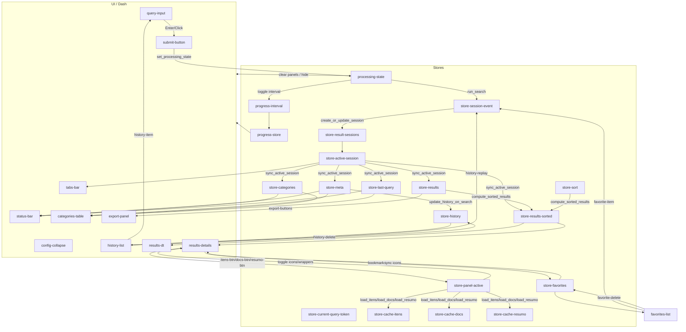

# GSB — Diagrama Funcional (v1)

Este documento descreve o fluxo funcional do GovGo Search Browser (GSB) com ênfase em callbacks, Stores e componentes UI. O diagrama e as seções abaixo estão hierarquizados e explicados por função.

## Visão geral (Mermaid)

## Estágios e callbacks principais

- Entrada e processamento
  - set_processing_state: cria token, emite EVENT pendente, marca PS=true.
  - run_search: consome PS, pré-processa consulta (Assistant), busca (direta/corresp/filtro), ordena, persiste histórico/resultados, emite EVENT concluído, limpa PS.
  - Progresso: progress-interval/update_progress_store/reflect_progress_bar controlam barra e spinner central.
- Sessões e Abas
  - create_or_update_session: dedup por assinatura; cria/atualiza sessões (query, pncp, history).
  - render_tabs_bar/on_tab_click: renderiza/ativa/fecha abas; estilo dinâmico para PNCP.
  - sync_active_session: reflete sessão ativa nas Stores legadas (RES, RESS, META, CATS_S, LQ).
- Renderização de resultados
  - clear_results_content_on_start/hide_result_panels_during_processing: limpam/ocultam painéis durante processamento.
  - render_status_and_categories: mostra status e tabela de categorias.
  - compute_sorted_results/init_sort_from_meta/on_header_sort/render_results_table: ordenação custom e tabela resumo.
  - render_details: cards com informações e painel direito (Itens/Documentos/Resumo).
  - toggle_results_visibility: mostra/esconde cards conforme tipo de aba (query/pncp/history).
- Painéis Itens/Docs/Resumo
  - set_active_panel/update_button_icons/toggle_panel_wrapper: toggle por PNCP.
  - load_itens_for_cards/load_docs_for_cards: busca e cache local por PNCP.
  - show_resumo_spinner_when_active/load_resumo_for_cards: spinner imediato; geração e cache de resumo (com persistência por usuário quando disponível).
- Histórico
  - init_history/render_history_list: carrega e exibe histórico (com configs gravadas).
  - run_from_history/delete_history_item/replay_from_history/update_history_on_search.
- Favoritos
  - init_favorites/load_favorites_on_results/render_favorites_list.
  - toggle_bookmark/sync_bookmark_icons/delete_favorite/open_pncp_tab_from_favorite.
- Exportações
  - export_files: JSON/XLSX/CSV/PDF/HTML para `Resultados_Busca`.

## Notas
- Estilos centralizados em `gvg_styles.py` (sem inline custom além do necessário).
- Favoritos: Store otimista reflete os mesmos campos dos cards; persistência no BD somente `(user_id, numero_controle_pncp, rotulo opcional)`.
- Resumo: uma geração por PNCP por sessão; cache em `store-cache-resumo`.
