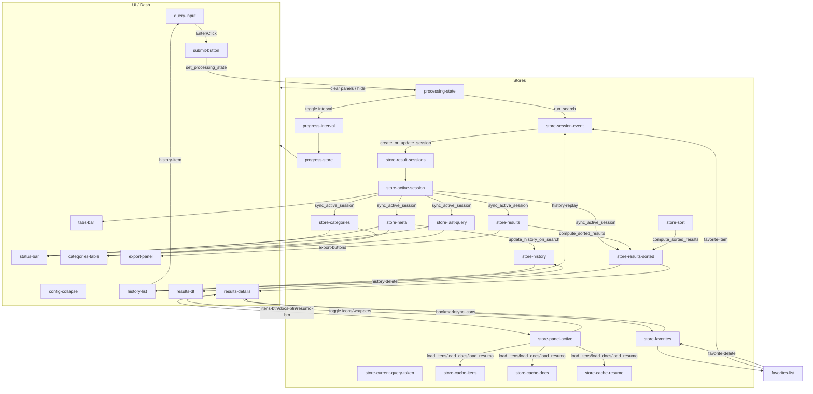

# GSB — Diagrama Funcional (v2)

Visão funcional do GSB com fluxo de callbacks, Stores e componentes. As seções trazem referências de linha do `GvG_Search_Browser.py` ("linha xxxx") e os módulos usados pelos callbacks principais, conforme o documento consolidado.

## Visão geral (Mermaid)

## Estágios e callbacks principais (com linhas e módulos)

- Entrada e processamento
  - set_processing_state (linha 4937) — cria token, emite EVENT pendente, marca PS=true. Usa: helpers {_has_any_filter}.
  - run_search (linha 3978) — consome PS, pré-processa (SearchQueryProcessor), busca (direta/corresp/filtro), ordena, persiste prompt/resultados, emite EVENT concluído, limpa PS. Usa: gvg_search_core, gvg_preprocessing, gvg_user, gvg_limits, gvg_usage, gvg_notifications, helpers.
  - Progresso — progress-interval/update_progress_store (linha 4849)/reflect_progress_bar (linha 4870) controlam barra e spinner central.

- Sessões e Abas
  - create_or_update_session (linha 4383) — dedup por assinatura; cria/atualiza sessões (query, pncp, history).
  - render_tabs_bar (linha 4474) / on_tab_click (linha 4629) — renderiza/ativa/fecha abas; PNCP com cor dinâmica via _enc_status_and_color.
  - sync_active_session (linha 4679) — reflete sessão ativa nas Stores legadas (RES, RESS, META, CATS_S, LQ).

- Renderização de resultados
  - clear_results_content_on_start (linha 4901) / hide_result_panels_during_processing (linha 4918) — limpam/ocultam painéis durante processamento.
  - render_status_and_categories (linha 5437) — status e tabela de categorias. Usa: helpers de formatação/estilos.
  - compute_sorted_results (linha 5834) / init_sort_from_meta (linha 5847) / on_header_sort (linha 5867) / render_results_table (linha 5595) — ordenação custom e tabela resumo. Usa: _sorted_for_ui.
  - render_details (linha 5674) — cards e painel direito (Itens/Documentos/Resumo). Usa: {_build_pncp_data,_format_*,_highlight_terms}.
  - toggle_results_visibility (linha 6558) — mostra/esconde cards conforme tipo de aba (query/pncp/history).

- Painéis Itens/Docs/Resumo
  - set_active_panel (linha 6454) / update_button_icons (linha 6501) / toggle_panel_wrapper (linha 6525) — toggle por PNCP.
  - load_itens_for_cards (linha 5903) — busca itens; cache em store-cache-itens. Usa: gvg_search_core.fetch_itens_contratacao.
  - load_docs_for_cards (linha 6012) — carrega documentos; cache em store-cache-docs. Usa: gvg_database.fetch_documentos.
  - show_resumo_spinner_when_active (linha 6401) — spinner imediato.
  - load_resumo_for_cards (linha 6107) — escolhe doc principal, resume e persiste em cache/BD por usuário. Usa: gvg_documents, gvg_database, gvg_limits/gvg_usage, gvg_notifications.

- Histórico
  - init_history (linha 5218) / render_history_list (linha 5228) — carrega e exibe histórico (com configs gravadas).
  - update_history_on_search (linha 6595) / run_from_history (linha 6621) / delete_history_item (linha 6653) / replay_from_history (linha 6699) — mantém, edita e reabre histórico. Usa: gvg_user.fetch_user_results_for_prompt_text, gvg_notifications.

- Favoritos
  - init_favorites (linha 7136) / load_favorites_on_results (linha 7201) / render_favorites_list (linha 7256) — carrega, ordena e lista.
  - toggle_bookmark (linha 7650) / sync_bookmark_icons (linha 7824) / delete_favorite (linha 7896) / open_pncp_tab_from_favorite (linha 4706) — alterna, sincroniza, remove e abre PNCP. Usa: gvg_user.{add_bookmark,remove_bookmark,fetch_bookmarks}, gvg_notifications.

- Exportações
  - export_files (linha 7961) — JSON/XLSX/CSV/PDF/HTML para `Resultados_Busca`. Usa: gvg_exporters.

## Notas
- Estilos centralizados em `gvg_styles.py`.
- Favoritos: atualização otimista reflete os mesmos campos dos cards; persistência no BD somente `(user_id, numero_controle_pncp)`.
- Resumo: uma geração por PNCP por sessão; cache em `store-cache-resumo`.
