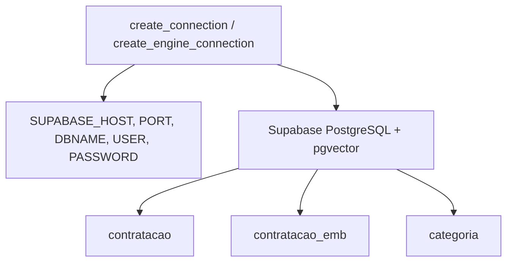

# 📊 Diagrama Funcional Completo - GvG_Search_Function (v1)

## 🎯 Visão Geral do Módulo

O `GvG_Search_Function` expõe uma API programática para busca PNCP com paridade de pipeline ao Prompt/Terminal: configura logging, processa a query (IA opcional), executa a busca (Semântica/Palavras‑chave/Híbrida) em três abordagens (Direta/Correspondência/Filtro), aplica filtro de relevância (IA, opcional), ordena, exporta (JSON/XLSX/CSV/PDF/HTML) e retorna um resumo com caminhos de log/exports.

---

## 🏗️ Arquitetura do Módulo

```mermaid
graph TB
    subgraph "PUBLIC API"
        F[GvG_Search_Function.py\n(gvg_search)]
    end

    subgraph "CORE"
        C[gvg_search_core.py\n(semantic/keyword/hybrid\n+ categorias + relevância)]
        P[gvg_preprocessing.py\n(SearchQueryProcessor)]
        A[gvg_ai_utils.py\n(embeddings/negation/keywords)]
        D[gvg_database.py\n(psycopg2/SQLAlchemy)]
        S[gvg_schema.py\n(colunas/builders)]
        X[gvg_exporters.py\n(JSON/XLSX/CSV/PDF/HTML)]
    end

    subgraph "EXTERNAL APIS"
        OAI[OpenAI API]
        PG[(PostgreSQL + pgvector)]
    end

    subgraph "EXTERNAL LIBS"
        RICH[Rich]
        PANDAS[Pandas]
        SQLALCHEMY[SQLAlchemy]
        REPORTLAB[ReportLab (opcional PDF)]
        REQS[Requests]
    end

    F --> C
    F --> P
    F --> X
    C --> D
    C --> S
    P --> OAI
    A --> OAI
    C --> OAI
    D --> PG

    F --> RICH
    F --> PANDAS
    F --> SQLALCHEMY
    F --> REPORTLAB
    F --> REQS
```

---

## 🔄 Fluxo Principal de Execução (gvg_search)

```mermaid
graph TD
    CALL[gvg_search(prompt, args...)] --> LOG[setup_logging\nLOG: Busca_{QUERY}_LOG_{ts}.log]
    LOG --> ARGS[Montar params\n(SimpleNamespace)]
    ARGS --> RUN[perform_search(params)]
    RUN --> EXPORT[Dispatch export\n(JSON/XLSX/CSV/PDF/HTML)]
    EXPORT --> RETURN[{Retornar dict\nresults/categories/confidence/elapsed\nexports/log_path/params}]
```

---

## 🔍 perform_search: Pipeline Interno

```mermaid
graph TD
    START[perform_search] --> INTEL{Processamento\nInteligente está ativo?}
    INTEL -->|Sim| PREP[SearchQueryProcessor\n→ search_terms, negative_terms, sql_conditions]
    INTEL -->|Não| RAW[Usar query original]

    PREP --> SAFE{Condições SQL seguras?\n(p.ex. sem %s literal, OR sem parênteses)}
    SAFE -->|Não| DISABLE[Desativar IA\napenas nesta execução]
    SAFE -->|Sim| KEEP[Manter IA]

    RAW --> CHECK_APP{Abordagem}
    KEEP --> CHECK_APP
    DISABLE --> CHECK_APP

    CHECK_APP -->|1 Direta| DIRECT[direct_search]
    CHECK_APP -->|2 Correspondência| CORR[correspondence_search]
    CHECK_APP -->|3 Filtro| FILTER[category_filtered_search]

    DIRECT --> REL[Filtro Relevância?\n(nível 2/3)]
    CORR --> REL
    FILTER --> REL

    REL -->|Sim| AI_REL[OpenAI Assistant\nflex/restrictive → reordenar/filtrar]
    REL -->|Não| SKIP_REL[Sem IA]

    AI_REL --> SORT[Ordenar por modo\n(similarity/data/valor)]
    SKIP_REL --> SORT
    SORT --> RANK[Reatribuir rank 1..N]
    RANK --> DONE[Tempo total, confiança, resumo]
```

---

## 1️⃣ Abordagem Direta

```mermaid
graph TD
    DIRECT[direct_search] --> TYPE{Tipo de Busca}
    TYPE -->|1 Semântica| SEM[semantic_search]
    TYPE -->|2 Palavras‑chave| KW[keyword_search]
    TYPE -->|3 Híbrida| HYB[hybrid_search]

    SEM --> VOPTS[GVG_VECTOR_OPT?\nCTEs candidatos+base]
    VOPTS -->|ON| OPT[Otimizada: filtros → KNN\nORDER BY distance ASC]
    VOPTS -->|OFF| FBACK[Fallback: SELECT simples\nORDER BY similarity DESC]

    SEM --> NEG{use_negation?}
    NEG -->|Sim| NEGEMB[get_negation_embedding]
    NEG -->|Não| EMB[get_embedding]

    KW --> FTS[to_tsvector/tsquery\nportuguese, rank exato + prefixo]
    HYB --> COMB[Combina embedding + FTS\nscore ponderado (SEMANTIC_WEIGHT)]
```

Notas:
- Sanitização de condições SQL do Assistant (ano_compra como texto, OR com parênteses, sem ce.* em keyword).
- Parâmetros via env: GVG_VECTOR_OPT, GVG_SQL_DEBUG, GVG_PRE_ID_LIMIT, GVG_PRE_KNN_LIMIT, NEGATION_EMB_WEIGHT.

---

## 2️⃣ Abordagem Correspondência (Categorias)

```mermaid
graph TD
    CORR[correspondence_search] --> TOPC[get_top_categories_for_query]
    TOPC --> CAT_EMB[1 - (categoria.cat_embeddings <=> emb(query))]
    CAT_EMB --> TOPN[Top N categorias]
    TOPN --> C_JOIN[Buscar contratos com ce.top_categories&&{codes}]
    C_JOIN --> SCORE[Score de correspondência\nmax(query_cat_sim * result_cat_sim)]
    SCORE --> META[Top category por resultado]
    META --> ORDER[Ordenar por score]\n
```

---

## 3️⃣ Abordagem Filtro (Categorias)

```mermaid
graph TD
    FILTER[category_filtered_search] --> TOPF[get_top_categories_for_query]
    TOPF --> BASE[Buscar universo base\n(Semântica/Keyword/Híbrida)]
    BASE --> INTSC[Interseção com ce.top_categories]
    INTSC --> CUT[Manter apenas resultados\ncom pelo menos 1 categoria relevante]
    CUT --> ORDERF[Atualiza rank e retorna]
```

---

## 🤖 Processamento Inteligente (Pré‑processamento)

```mermaid
graph TD
    Q[Query] --> P1[SearchQueryProcessor]
    P1 --> OAI1[OpenAI Assistants\n(GVG_PREPROCESSING_QUERY_v1)]
    OAI1 --> OUT1[search_terms, negative_terms, sql_conditions, explanation]
    OUT1 --> SAFE1[Heurística de segurança\n(%s literal, OR sem parênteses)]
    SAFE1 -->|Inseguro| TEMP_OFF[IA desativada nesta execução]
    SAFE1 -->|Seguro| CONT[Seguir com IA]
```

---

## 🎯 Filtro de Relevância (Nível 2/3)

```mermaid
graph TD
    RES[Resultados + ranks] --> CHECK{Nível > 1?}
    CHECK -->|Sim| PACK[Empacotar posições/descrições]
    PACK --> OAI2[Assistant Flex/Restrict\n(GVG_RELEVANCE_FLEXIBLE / GVG_RELEVANCE_RESTRICTIVE)]
    OAI2 --> RESP[Lista de posições ordenadas]
    RESP --> APPLY[Filtrar e reordenar]
    CHECK -->|Não| BYPASS[Sem filtro]
```

---

## 📄 Exportação e Nomenclatura

```mermaid
graph TD
    EXP[export_results_*] --> NAME[generate_export_filename\nBusca_{QUERY}_S{type}_A{approach}_R{relevance}_O{order}_I{flag}_{ts}.{ext}]
    EXP --> JSON[JSON]
    EXP --> XLSX[XLSX]
    EXP --> CSV[CSV]
    EXP --> PDF[PDF (se ReportLab)]
    EXP --> HTML[HTML]
```

Observações:
- HTML com tabela estilizada leve; PDF opcional via ReportLab.
- Diretório de saída passado em `output_dir` (default: `Resultados_Busca`).

---

## 💾 Banco de Dados e Esquema (V1)



Campos principais expostos por `gvg_schema.py` para SELECTs: dados core de `contratacao` e vetores/arrays de `contratacao_emb`.

---

## ⚙️ Configurações e Flags (env)

- OPENAI_API_KEY
- GVG_PREPROCESSING_QUERY_v1
- GVG_RELEVANCE_FLEXIBLE / GVG_RELEVANCE_RESTRICTIVE
- SUPABASE_HOST / SUPABASE_PORT / SUPABASE_DBNAME / SUPABASE_USER / SUPABASE_PASSWORD
- NEGATION_EMB_WEIGHT
- GVG_VECTOR_OPT / GVG_SQL_DEBUG / GVG_PRE_ID_LIMIT / GVG_PRE_KNN_LIMIT

---

## 🧪 Saída e Resumo

- Retorno: `{ results, categories, confidence, elapsed, log_path, exports, params }`
- Logging: `Busca_{QUERY}_LOG_{timestamp}.log` no `output_dir`.
- Confiança: média dos scores (0..1) convertida para % em `calculate_confidence`.
